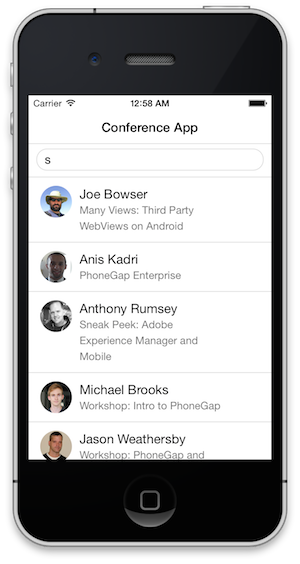

## What are we building?
In this workshop you will learn how to create a mobile Conference Application using PhoneGap with HTML, JavaScript and CSS. Best
practices and performance techniques will also be taught as you complete each module.

## What You Will Learn:

- How to create and build (compile and package) a PhoneGap project using the CLI (Command Line Interface).

- How to create a PhoneGap project using the PhoneGap Desktop App.

- How to test a PhoneGap project using the PhoneGap Developer App on your mobile device.

- How to use different data storage strategies.

- How to build an application using a single-page architecture and HTML templates.

- How to handle specific mobile challenges such as touch events, scrolling, styling, page transitions, etc.

- How to use several PhoneGap APIs via plugins.

## Requirements

- To complete this workshop, all you need is a code editor, a modern browser, and a connection to the Internet.

- A working knowledge of HTML and JavaScript is assumed, but you don't need to be a JavaScript guru.

>A mobile device or a Mobile SDK is **not** a requirement for this tutorial. You will able to test your application in the browser or with the PhoneGap Developer App with some limitations. If you want the full support of the native APIs then you will need the mobile SDK for that platform (iOS SDK, Android SDK, etc.) installed on your system. 

## Issues

- Please create an issue [here](https://github.com/hollyschinsky/phonegap-workshop/issues) if you run
into any problem or if you have feedback.

- You can also use the Comments section at the bottom of each module to ask a question or report a problem.

- You can contact me on Twitter:

    <a href="https://twitter.com/devgirlfl" class="twitter-follow-button" data-show-count="true" 
    data-size="large" data-lang="en">Follow 
    @devgirlfl</a>
    

<a href="create-project.html" class="btn btn-default pull-right">Next <i class="glyphicon
glyphicon-chevron-right"></i></a>

