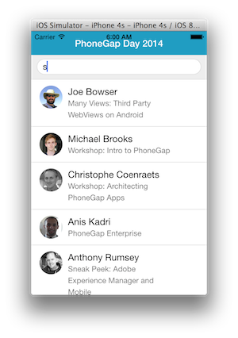
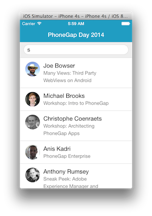
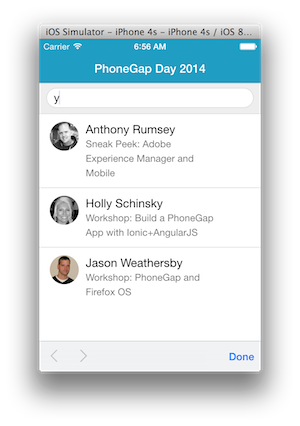
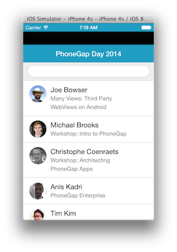
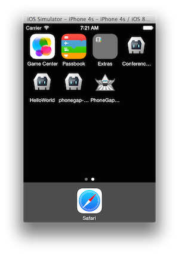
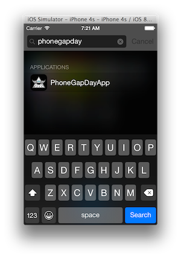

This module is going to take you through a couple steps to polish the application a bit more. 

###Styling
1. Open the assets/css/styles.css and add the following to the bottom to style the header bar, search bar and icons:

```
.media>p {
    color: #444;
}
.bar-nav {
    background-color: #209dc2;
    color: #ffffff;
}
.title {
    color: #ffffff;
}
.bar-nav .icon {
    color: #ffffff;
}
.bar-header-secondary {
    background-color: #eeeeee;
}
```

1. Test the application

    

* It looks better, but you may notice the status bar header seems to overlap the space where the application header resides. The next step will address this.

###Status Bar Handling

In iOS7, the status bar overlaps the application views. As a result, the status bar text may collide with the 
application's header text as shown in the screenshot above. You can fix this issue using the [statusbar plugin](https://github.com/apache/cordova-plugin-statusbar). 

1. Add the status bar plugin:

    ```
    phonegap plugins add org.apache.cordova.statusbar
    ```

2. There are two options for fixing this issue, via configuration or programmatically. Choose to implement one of the options below:

    -Configuration (config.xml):
   
        Setting overlay to false will move our app content below the status bar. We're also setting the status bar background style and text/icons to match the app:   
   
        Open the config.xml file and add the following lines to the end of the preferences:
  
        ```      
           <preference name="StatusBarOverlaysWebView" value="false" />
           <preference name="StatusBarBackgroundColor" value="#209dc2"/>
           <preference name="StatusBarStyle" value="lightcontent" />
        ```    

    -Programatically:
      In app.js, add the following code at the top of the **deviceready** handler:
    
    ```    
        StatusBar.overlaysWebView( false );
        StatusBar.backgroundColorByHexString('#209dc2');
        StatusBar.styleLightContent();
    ```    


3. Now build and run the application again to see the results:


    
  
    
###Keyboard Accessory Bar 

We can suppress the accessory keyboard that pops up with the **Done** button on it as shown in this screenshot by using a custom plugin from the Ionic Framework and then use a method to hide it:




1. Add the [Ionic Keyboard Plugin](https://github.com/driftyco/ionic-plugins-keyboard):

  ```  
  phonegap plugin add https://github.com/driftyco/ionic-plugins-keyboard
  ```
  
2.  In app.js, add the following code at the top of the **deviceready** handler:

```
    if (cordova.plugins.Keyboard)
        cordova.plugins.Keyboard.hideKeyboardAccessoryBar(true);
```            

3. Now build the application again and test to see the result.


###Turn off WebView Bounce / Overscroll Effect



You may notice if you pull down on your app from the header bar, you will see a black space between it and the statusbar and a bounce effect on iOS as shown above. 

You can disable this effect by setting a property in the config.xml file. 
1. In the root project config.xml, add the following property to the end of the preferences:

```
<preference name="DisallowOverscroll" value="true" />
```

2. Now build and run the application again and the webview should stay in place. 

###Set a default application icon

You may want to set a default application icon to be used for all the icons in your application. 

1. In the root project's config.xml, add the following property to point to the icon *phonegap_wings.png* from the initial project download. 

```
    <icon src="phonegap_wings.png" />
```
Note that this path is relative to the project root. There's a lot more involved with setting icons and splash screens than
 what we'll go into here, but please see [this article](http://devgirl.org/2014/09/29/new-icons-and-splash-screen-help-for-cordovaphonegap/) for more details.
 
  