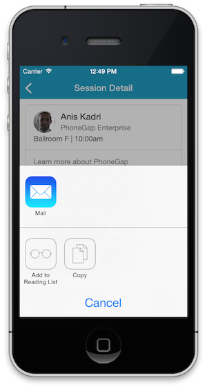

In this section, we add the ability to share the session details through the device's native sharing options. 


## Steps

1. Add the social sharing plugin to your project:

    ```
    $ phonegap plugin add https://github.com/EddyVerbruggen/SocialSharing-PhoneGap-Plugin/
    
    ```

1. In **index.html**, add the following tab to the tab bar in the *session-tpl* template:

    ```
    <div class="shareBtn tab-item">
        <span class="icon icon-share"></span>
        <span class="tab-label">Share</span>
    </div>
    ```

1. In the **initialize()** function of *SessionView*, register an event listener for the click event of the *share* tab.

    ```
    this.$el.on('click', '.shareBtn', this.share);
    ```

    > Make sure you add this line as the last line of the **initialize()** function (after this.$el is assigned).

1. While in *SessionView*, define the *share* event handler as follows:

    ```
    this.share = function() {
      if (window.plugins.socialsharing) {
          window.plugins.socialsharing.share("I'll be attending the session: " + session.title + ".",
              'PhoneGap Day 2014', null, "http://pgday.phonegap.com/us2014",
              function () {
                  console.log("Success")
              },
              function (error) {
                  console.log("Share fail " + error)
              });
      }
      else console.log("Share plugin not found");
    }
    ```

1. Test the Application



>The options shown here will depend on your particular devices' native sharing options. 

<div class="row" style="margin-top:40px;">
<div class="col-sm-12">
<a href="add-to-calendar.html" class="btn btn-default"><i class="glyphicon glyphicon-chevron-left"></i> 
Previous</a>
<a href="statusbar.html" class="btn btn-default pull-right">Next <i class="glyphicon 
glyphicon-chevron-right"></i></a>


</div>
</div>


